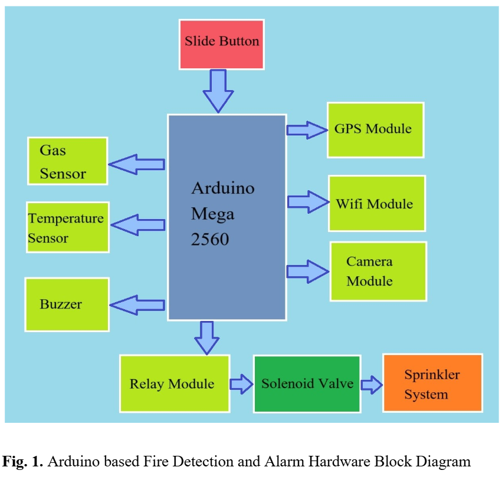
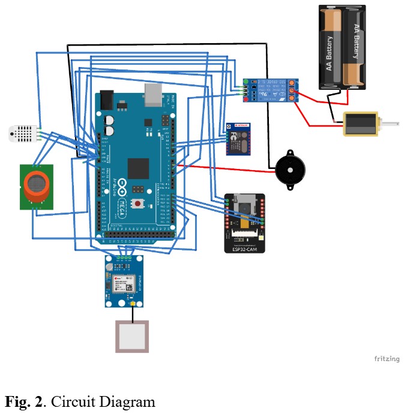
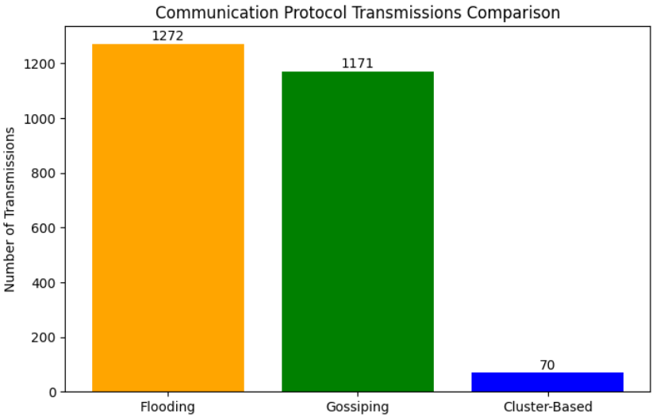
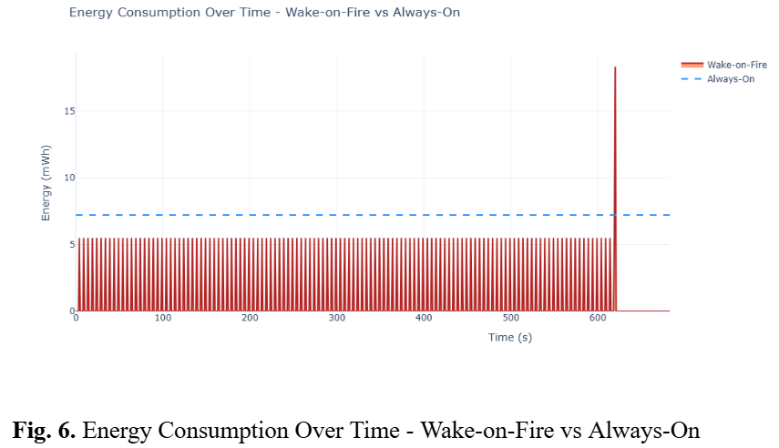

# Fire System for Smart Home Fire Response
"Kalman Enhanced Wake on Fire System for Smart Home Fire Response with Network and Energy Optimization" accepted for presenting & publishing in the 6th IEEE India Council International Subsections Conference (INDISCON 2025) (21st Aug-23rd Aug) under Track:12.

---

## 🚀 Quick Facts & Impact

- **Energy Consumption Reduced:** Up to **20.56%** energy savings with Wake-on-Fire protocol (see Fig. 4)
- **Noise Reduction:** Kalman filter improves sensor accuracy, lowering RMSE and MAE for temperature readings *(e.g., RMSE reduced to 0.62°C with tuning)*
- **Network Efficiency:** Cluster-based communication cuts wireless transmissions by **94%** compared to flooding (70 vs 1272 transmissions, Fig. 3)
- **Fast, Multi-modal Response:** Real-time alerts via WiFi, GPS location, live camera, automated sprinkler control

---

## 📦 System Architecture

This IoT system leverages an **Arduino Mega 2560** as its hub, integrating:
- **Gas and Temperature Sensors** for early fire/smoke detection
- **WiFi & GPS Modules** for real-time alerts and geo-tagging
- **Camera Module (ESP32-CAM)** for instant visual confirmation
- **Relay and Solenoid Valve** to trigger the **Sprinkler System** automatically
- **Buzzer** for local alarms
- **Slide Button** for manual activation/testing

**Hardware Block Diagram:**

---

## 🔗 Circuit Implementation

Components are connected as shown below, ensuring reliable communication and safe actuation in emergency situations.

**Circuit Diagram:**

---

## 📊 Performance Evaluation

### 1. **Communication Protocol Efficiency**
- **Cluster-Based Routing:** Only **70 transmissions** needed vs. 1171 (Gossiping) and 1272 (Flooding)
  - **Result:** Maximizes wireless network scalability and battery life

**Transmission Comparison:**

### 2. **Energy Consumption Optimization**
- **Wake-on-Fire mode:** Achieves over **20% less energy usage** compared to "Always-On"
  - **Fig. 4**: Notice the drastic reduction in average consumption, crucial for battery-backed IoT deployments

**Energy Consumption Over Time:**

---

## ⚙️ How It Works

1. **Continuous Monitoring:** Sensors collect gas and temperature data.
2. **Noise Filtering:** Kalman filter algorithms process inputs, enhancing detection reliability and suppressing false positives.
3. **Event Trigger:** Upon fire/gas event:
   - Sounds buzzer, takes a photo, grabs GPS position
   - Sends complete alert to the cloud (via WiFi)
   - Activates relay → solenoid valve → sprinkler system
4. **Advanced Networking:** Tested using different communication protocols for deployment in multi-node IoT networks; cluster-based protocols proved most efficient in terms of speed and energy.

---

## 🏆 Key Features and Advantages

- **Multi-Sensor Fusion:** Early detection of fire through combined gas and temperature sensing
- **Kalman Filtering:** Suppresses sensor noise, improving detection rates and alarm reliability
- **Automated Suppression:** Instantly deploys sprinkler to control fire without delay
- **Cloud Alerts & Geotagging:** Pushes real-time notifications with images and location for remote safety monitoring
- **Superior Scalability:** Suits both individual smart homes and large building networks
- **Energy-optimized:** Wake-on-Fire logic prolongs battery and device lifetimes

---

## 📚 Further Reading

- See the full research paper and simulation scripts in this repository for a deeper dive into algorithms, experimental results, and deployment notes.

---
